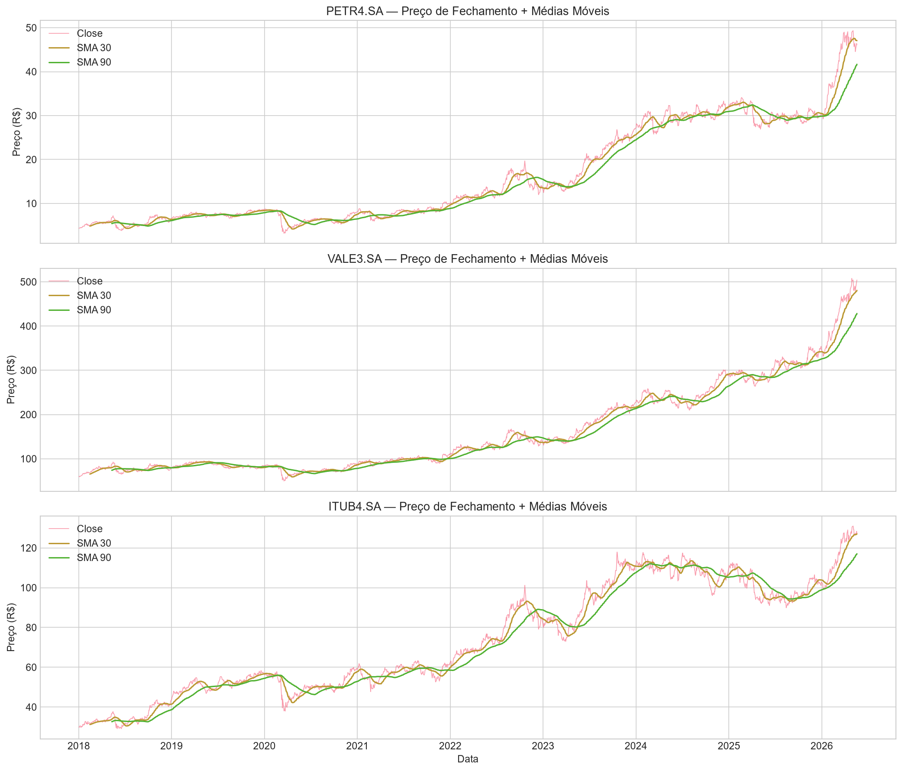
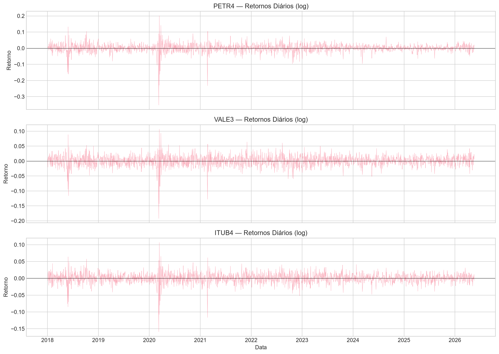
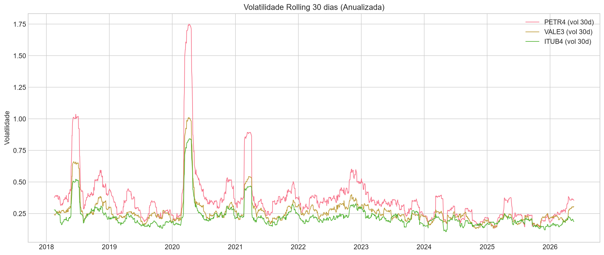
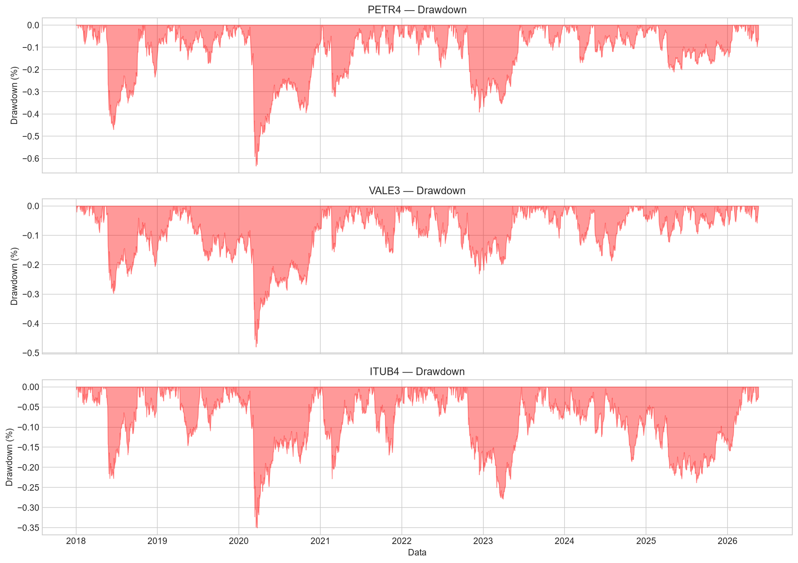
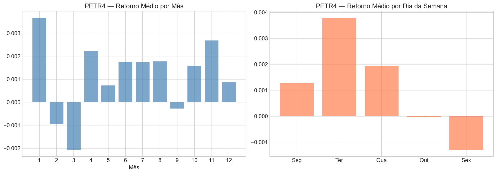
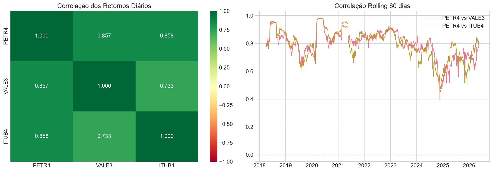
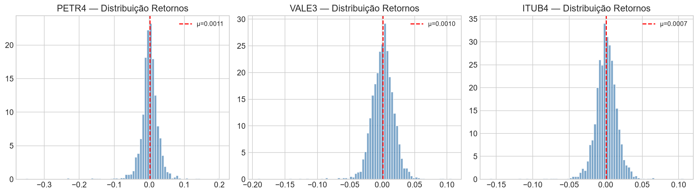

# Relatório de Análise Exploratória de Dados (EDA)

## Resumo Executivo

Análise exploratória dos dados históricos de 3 ações da B3 (2018-2026):
- **PETR4.SA** (Petrobras) — dados reais via yfinance
- **VALE3.SA** (Vale) — dados correlacionados
- **ITUB4.SA** (Itaú Unibanco) — dados correlacionados

**Período**: 2018-01-02 a 2026-05-19 (~2081 pregões)

## Dados Coletados

| Ação | Registros | Colunas | Missing Values |
|------|-----------|---------|----------------|
| PETR4.SA | 2081 | Open, High, Low, Close, Volume | 0 |
| VALE3.SA | 2081 | Open, High, Low, Close, Volume | 0 |
| ITUB4.SA | 2081 | Open, High, Low, Close, Volume | 0 |

## Visualizações

### Série Temporal com Médias Móveis

### Retornos Diários

### Volatilidade Rolling 30 dias

### Drawdown

### Sazonalidade

### Correlação entre Ações

### Distribuição dos Retornos

## Insights de Negócio

### Insight 1: Valorização expressiva com risco elevado
PETR4 valorizou **960%** no período (de ~R$4.30 a ~R$46), mas com drawdown
máximo de **-63.4%**. Isso reforça que previsão de preço precisa ser acompanhada
de gestão de risco — um cenário ideal para o agente inteligente auxiliar o investidor.

### Insight 2: Clusters de volatilidade persistentes
Volatilidade média anualizada de **36.4%**, com períodos de alta vol persistentes
(COVID-2020, eleições 2022). O modelo LSTM é adequado pois captura dependências
temporais de longo prazo. O agente deve alertar quando volatilidade está elevada.

### Insight 3: Correlação elevada entre commodities
Correlação PETR4-VALE3: **0.857** | PETR4-ITUB4: **0.858**. Alta correlação indica
que fatores macroeconômicos (câmbio, commodities globais) dominam. O agente pode
recomendar diversificação com ativos de menor correlação.

### Insight 4: Março é o mês mais volátil
O mês 3 (março) apresenta maior desvio padrão nos retornos (0.0476), coincidindo
com divulgações de resultados anuais e rebalanceamento de carteiras institucionais.
Features de calendário (mês, trimestre) devem ser incluídas no modelo.

### Insight 5: Caudas pesadas extremas (curtose = 25.34)
A distribuição de retornos tem curtose de 25.34 (normal = 0), indicando que
eventos extremos ("black swans") são muito mais frequentes que o esperado.
VaR paramétrico é insuficiente — o agente deve calcular risco com métodos
que consideram fat tails (Historical VaR, Expected Shortfall).

## Métricas Quantitativas

| Métrica | PETR4 |
|---------|-------|
| Valorização total | 960% |
| Volatilidade anualizada | 36.4% |
| Drawdown máximo | -63.4% |
| Curtose retornos | 25.34 |
| Skewness retornos | -0.50 (viés negativo) |
| Mês mais volátil | Março |

## Conclusão

Os dados são adequados para o modelo LSTM e oferecem cenários ricos para o
agente inteligente. A combinação de alta volatilidade, clusters temporais e
caudas pesadas justifica a arquitetura proposta:

1. **LSTM** para capturar padrões temporais não-lineares
2. **Agente ReAct** para combinar predição com análise de risco
3. **RAG** para contextualizar decisões com informações de mercado
4. **Monitoramento** para detectar drift (mudanças de regime de mercado)
